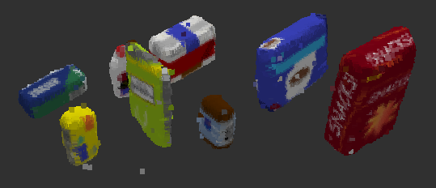

# Project: Perception Pick & Place

## Required Steps for a Passing Submission:
1. Extract features and train an SVM model on new objects (see `pick_list_*.yaml` in `/pr2_robot/config/` for the list of models you'll be trying to identify). 
2. Write a ROS node and subscribe to `/pr2/world/points` topic. This topic contains noisy point cloud data that you must work with.
3. Use filtering and RANSAC plane fitting to isolate the objects of interest from the rest of the scene.
4. Apply Euclidean clustering to create separate clusters for individual items.
5. Perform object recognition on these objects and assign them labels (markers in RViz).
6. Calculate the centroid (average in x, y and z) of the set of points belonging to that each object.
7. Create ROS messages containing the details of each object (name, pick_pose, etc.) and write these messages out to `.yaml` files, one for each of the 3 scenarios (`test1-3.world` in `/pr2_robot/worlds/`).  [See the example `output.yaml` for details on what the output should look like.](https://github.com/udacity/RoboND-Perception-Project/blob/master/pr2_robot/config/output.yaml)  
8. Submit a link to your GitHub repo for the project or the Python code for your perception pipeline and your output `.yaml` files (3 `.yaml` files, one for each test world).  You must have correctly identified 100% of objects from `pick_list_1.yaml` for `test1.world`, 80% of items from `pick_list_2.yaml` for `test2.world` and 75% of items from `pick_list_3.yaml` in `test3.world`.

# Extra Challenges: Complete the Pick & Place
7. To create a collision map, publish a point cloud to the `/pr2/3d_map/points` topic and make sure you change the `point_cloud_topic` to `/pr2/3d_map/points` in `sensors.yaml` in the `/pr2_robot/config/` directory. This topic is read by Moveit!, which uses this point cloud input to generate a collision map, allowing the robot to plan its trajectory.  Keep in mind that later when you go to pick up an object, you must first remove it from this point cloud so it is removed from the collision map!
8. Rotate the robot to generate collision map of table sides. This can be accomplished by publishing joint angle value(in radians) to `/pr2/world_joint_controller/command`
9. Rotate the robot back to its original state.
10. Create a ROS Client for the “pick_place_routine” rosservice.  In the required steps above, you already created the messages you need to use this service. Checkout the [PickPlace.srv](https://github.com/udacity/RoboND-Perception-Project/tree/master/pr2_robot/srv) file to find out what arguments you must pass to this service.
11. If everything was done correctly, when you pass the appropriate messages to the `pick_place_routine` service, the selected arm will perform pick and place operation and display trajectory in the RViz window
12. Place all the objects from your pick list in their respective dropoff box and you have completed the challenge!
13. Looking for a bigger challenge?  Load up the `challenge.world` scenario and see if you can get your perception pipeline working there!

## [Rubric](https://review.udacity.com/#!/rubrics/1067/view) Points
### Here I will consider the rubric points individually and describe how I addressed each point in my implementation.  

---
### Writeup / README

#### 1. Provide a Writeup / README that includes all the rubric points and how you addressed each one.
You're reading it!

### Exercise 1, 2 and 3 pipeline implemented
#### 1. Complete Exercise 1 steps. Pipeline for filtering and RANSAC plane fitting implemented.

#### 2. Complete Exercise 2 steps: Pipeline including clustering for segmentation implemented.  

#### 3. Complete Exercise 3 Steps.  Features extracted and SVM trained.  Object recognition implemented.
Training steps were completed using the supporting [Perception-Exercises](https://github.com/kevinfructuoso/Perception-Exercises) repository. The training set up used for this project can be found in the Perception-Project folder of this repository and follows the same process as Exercise 3. The final project creates a model with 20 captures and uses a training SVM with an RBF kernel as opposed to the linear kernel used in the Exercise. These two steps were taken in order to increase model accuracy.

The resulting raw and normalized confusion matrices are shown below. The model correctly identified objects 156/160 times for an accuracy of 97.5%. A 5-fold cross validation was used and resulted in an accuracy range of 97% +/- 0.5%.

#### Confusion Matrices

  

  

### Pick and Place Setup

#### 1. For all three tabletop setups (`test*.world`), perform object recognition, then read in respective pick list (`pick_list_*.yaml`). Next construct the messages that would comprise a valid `PickPlace` request output them to `.yaml` format.

The first step in the perception pipeline was to remove noise from the raw RGB-D images. A sample of the raw image is shown below. This is achieved with a statistical outlier filter applied to the raw point cloud.

  

From there, the point cloud is then downsampled using a Vox filter. Passthrough filters were applied in both the Z and Y axes. This was done in order to focus on a specific section of the point cloud that includes only the tabletop and the objects of interest. RANSAC Plane segmentation was then applied to separate the objects from the tabletop. The results thus far can be seen in the below image.

    

Next, Euclidean clustering and object recognition can be applied to the point cloud containing the objects only. Using the model discussed in the previous section, the below image shows the results of the object recognition. The project succeeded in correctly identifying all objects repeatably.

  

The below images show the identification results of each tabletop scenario with the objects in their normal color patterns. The object recognition is 100% accurate in each of these settings.

  

  

  

 
The generated pick and place service output.yaml files can be found in the [config](https://github.com/kevinfructuoso/3D-Perception-Project/tree/master/pr2_robot/config) folder under files [output_1.yaml](https://github.com/kevinfructuoso/3D-Perception-Project/tree/master/pr2_robot/config/output_1.yaml), [output_2.yaml](https://github.com/kevinfructuoso/3D-Perception-Project/tree/master/pr2_robot/config/output_2.yaml), and [output_3.yaml](https://github.com/kevinfructuoso/3D-Perception-Project/tree/master/pr2_robot/config/output_3.yaml).

At the moment, the PR2 robot cannot reliably complete the pick and place movements. A collision map needs to be implemented in order to do so. Other ways to improve upon this project include the below list:
- improving training model to 100% accuracy
- fine tuning the statistical outlier filter to remove all noise - some remnants of the noise can be seen in the provided sceenshots
- tackle the challenge scenario with multiple tabletops